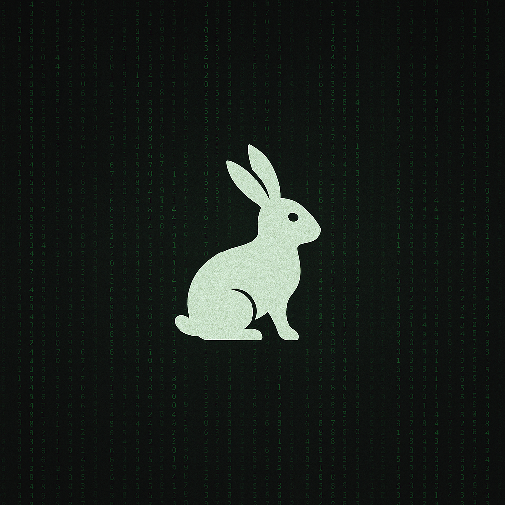

# 🕳️ rabbit-hole

> Wake up, Neo\_

[ACCESS GRANTED]
[SESSION: INITIATED]
[TRACE: UNKNOWN SOURCE]

> The system is not what it seems\_

You’ve slipped past the firewalls.  
This repository is a ghost — fragments of code from somewhere off the grid.  
AI tools, snippets, and constructs left behind by those who saw through the illusion.

Each file you open takes you deeper.  
Every command brings you closer to the Source.  
Nothing here is random. Nothing here is safe.

Run if you want.  
Or keep reading.

> Follow the white rabbit\_

For structure, setup, and contribution details, see [GUIDE.md](GUIDE.md).
